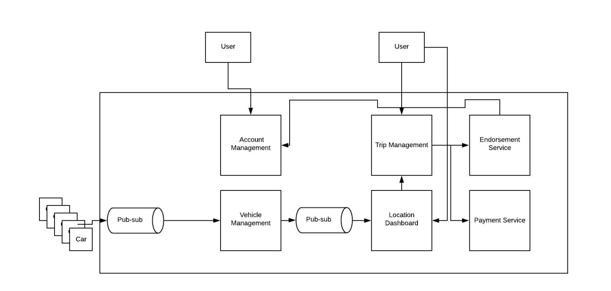
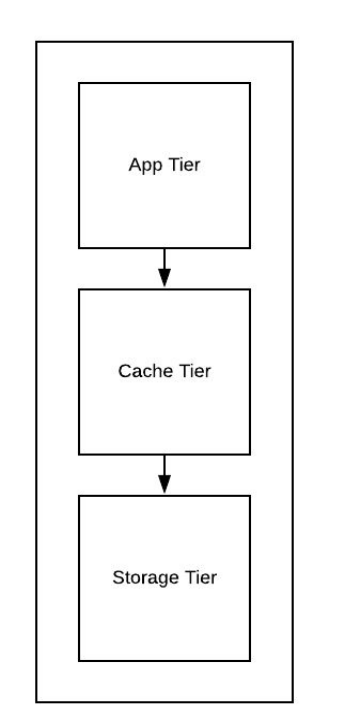
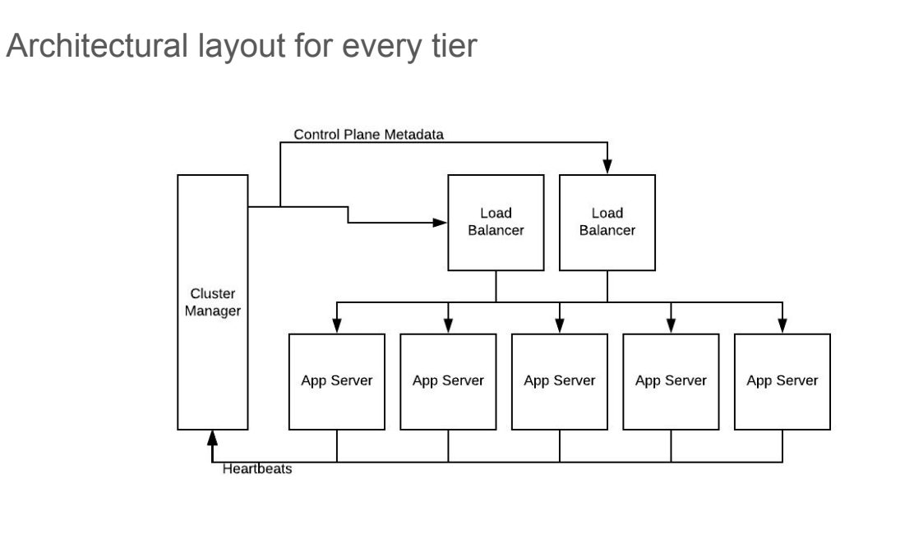
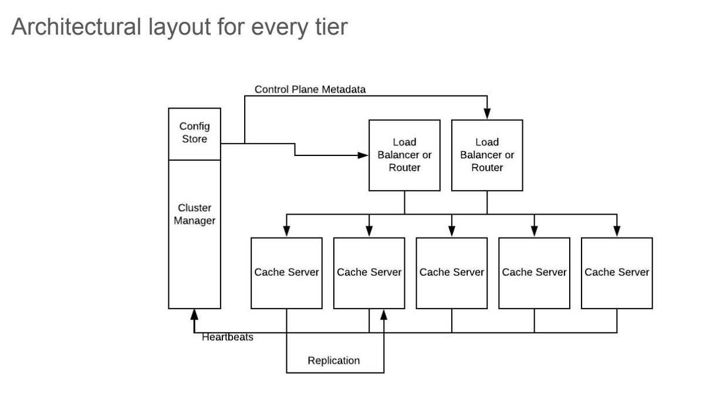
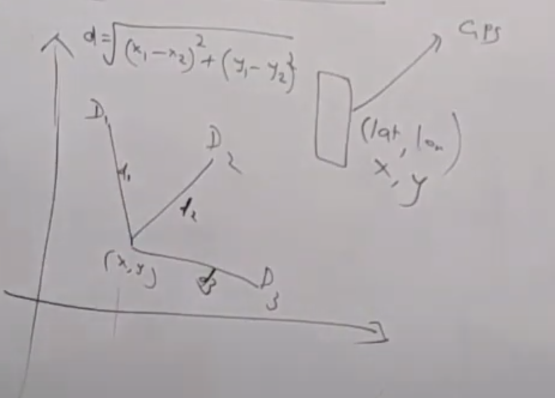
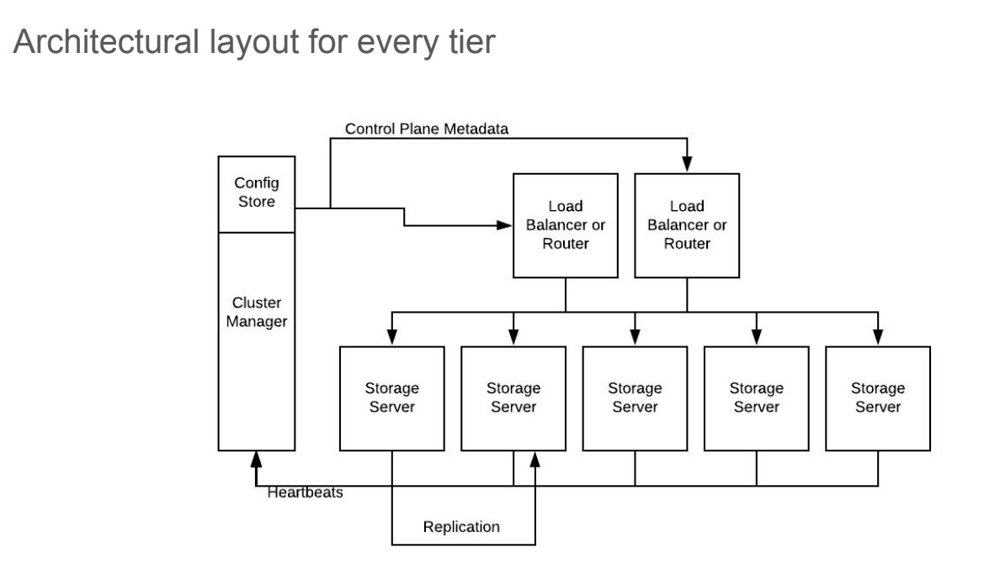

# Step 1: 
## a. Collect functional requirement
- User account management for Riders and Drivers
- Location based multiple vehicle dashboard for riders
- Rider can request for trip, should be able to give options, should get cost and ETA
    - Book in advance
    - Realtime 
- Driver should be able to accept/reject trip request
- Routing
- Once trip is set, rider should be able to check the progress of of the vehicle
- Rider pays driver
- Rider and driver endorse each other
- 
## b. Collect design constraints
- Number of riders: 80 millions 
- Number of drivers: 4 millions
- Number of trip per month: 14 millions

# Step 2:
## a. Bucketize functional requirements into micro services
- Account management micro service (Riders + Drivers)
- Vehicle management micro service
- Trip management micro service
- Location based dashboard micro service
- Payment management micro service
- Endorse management micro service
## b. Get clarity whether problem is breadth-oriented or depth-oriented
- Clearly a breadth oriented problem

# Step 3:
## a. Draw a logical diagram


## b. Draw and explain data/logic flow between them


# Step 4:
Micro service to focus for Uber
- Vehicle management micro service
- Location based dashboard micro service
- Trip management micro service

## a. Vehicle management service

- Tiers
    - App tier
    - Cache tier
    - Storage tier
- Data model 
    - K: Vin
    - V: location, status, other static properties
- Cache tier - store as hashmap 
- Storage tier - row oriented K-V store
- APIs
    - create(K,V) when register
    - update(K,V)
- Algorithm in API
    - Simple K-V workload
- Flows of API
    - App server tiers consumes new vehicle registration and location updates
    - Sends to cache server tier
    - Write back caching    
## b. Vehicle management service
- Need to scale for storage? No
    - Amount of storage in cache tier
        - Number of vehicle * size of K-V pair per vehicle
        - 4 millions drivers ~ 4 millions cars ~ 4,0000,000 kb ~ 4GB
    - Amount of storage in storage tier
        - Number of vehicle * size of K-V pair per vehicle
        - 4 millions drivers ~ 4 millions cars ~ 4,0000,000 kb ~ 4GB
    - Really minimal
- Need to scale for throughput? Yes
    - Number of update API call per seconds: millions per sec
    - Cannot be handled by single server
    - Optimize update(K,V) api 
        - Copy on write 
            ```
            Vehicle ID  Lat     Long
            V1          L1      L1
            V2          L2      L2
            V3          L2      L2
            V4          L1      L1
            V5          L1      L1
            ```              
    - Number of servers required per tier:
        - 1 thread : 100 ms
        - Number of request served by one thread in one second: 1000/100 = 10 
        - Server with 100 thread with 60% CPU capacity
            - Total: 100*.70 * 10 = 700 per seconds
        - Total drivers: 4 millions  
        - Active drivers : 25%
        - Total drivers: 1 millions
        - Expected load per second: 1 millions per seconds
        - Number of servers = 1 millions / 700 = 1,428
- Need to scale for API parallelization? No
    - APIs themselves are constant latency, so no need for parallelize
- Availability? Yes
- Geo location based distribution? Yes
    
## c. Vehicle management service
### App Server:


### Cache Server:


### Storage server:

- Sharding
    - Horizontal sharding
    - Map subset of vehicle to single shard
- Placement of shards on servers
    - Consistent hashing
- Replication
    - Yes, for availability and throughput
- CP or AP
    - AP: does not need to be strictly nano seconds consistencies
    - Best configuration, N = 3 or more
    - R =1, W= 1
    - High throughput
    - lowest latency
- 
## a. Location based dashboard micro service
- Tiers
    - App server
    - Cache server
    - Storage server
- Data model
    - K-V pair
    - K: location id
    - V: list of {vehicle + properties + location}
- Complex design
    - Hierarchial data model like map
    - Aggregation at various depth
    - Explore Quad Tree design 
- How to store in Cache layer?
    - Tree in memory
- How to store in storage layer?
    - Serialize as blobs or files
- API
    - searchVehicles(locationId, properties) > search vehicles with certain properties and location id
    - Algorithm1
        - Compute distance for each vehicle, sort and get the top x
        
        - Complexity O(N) where N is number of vehicles
        - For active drivers = 1 millions
        - Commodity server takes 100 ms to run 10,000 loops
        - Total time = (1000,000/10,000) * 100 ms = 100 * 100 ms = 10 sec
    - Algorithm 2
        - Limit my search space for vehicles
        - Divide world map into squares (Google open sourced it)
        - Get square box for my location id
        - For given square box, get location ids of vehicles
        - for vehicles location ids, apply other filters and get details
        - Main goal is to how to map vehicle location id and rider location id to static square box
            - Rider open app, he comes with lat/long
            - Convert lat/long to location id
            - Pre-generate static mapping of lat/long for each square box and map to locationId
                ```
                latX    latY    longX   longY   locationId   
                100     100     200     200     1                    
                ```
            - Store this data in database as geo spatial index
            - Use rider lat/long to perform binary search based range query to find out locationId
            - For given rider's locationId, how to find out vehicles?
                - Store rider table
                ```
                    Rider ID  Location Id
                    R1          L1
                    R2          L2
                    R3          L2
                    R4          L1
                    R5          L1
                ```                
            - Optimize update(K,V) api
                - Get vehicles locationId for given lat/long and store in db
                - use copy on write to avoid write contention/hotspot      
                ```
                Vehicle ID  Location Id
                V1          L1
                V2          L2
                V3          L2
                V4          L1
                V5          L1
                ```
                - Build inverted index based on locationId for quick lookup and use copy/write to update it
                ```
                LocationId  Vehicle Id
                L1          [V1, V4, V5]
                L2          [V2, V3]
                ```  
            - For given rider locationId, get the list of vehicles
            - If in current locationId, there are very few vehicles, then go extra layer to get all neighbor locationIds and fetch vehicles again
            - Generate level1 static mapping for faster lookup
            - level1 and level2 query can go in parallel
    - Algorithm 3
        - Use Algorithm 2 approach to store vehicles/rider data
        - Algorithm 2 doesn't make any difference between ocean square vs SFO
        - Algorithm 2, doesn't consider rush hours
        - Use Quad tree i.e. variable square 
        - For example, in morning, SFO should have smaller square to handle rush hours
        - Start with entire world map as square as one location
        - As soon as new vehicle is added and goes greater than 100 then split into 4 square
        - Keep performing split if vehicles in that square goes beyond 100 limit
        - In night time, if number of vehicles decreasing then merge quad tree 
        - I.e. if parent goes less than 100 then collapse
        - Time complexity O(100)
- Simple API
## b. Location based dashboard micro service
- Need to scale for storage? Yes
    - Amount of storage in cache and storage layer?
    - Number of unique location ids * size of each K-V pair
- Need to scale for throughput? Yes
    - Number of API calls per second: (number of trips/sec) * (number of location views / trip)
    - Number of servers required per tier: TBD
- Need to scale API for parallelization ? No
- Availability? Yes
- Geo location based distributions? Yes

## c. Location based dashboard micro service
- Sharding
    - Horizontal sharding
    - Map subsets of location ids to single shard
    - Geo distributed
- Placement of shards
    - Consistent hashing
- Replication
    - Yes
- CP or AP
    - AP - does not needs to be strictly nano second level consistent 
    - Best configurations: N=3 or R=1 , W=1 , high throughput, low latency
## a. Trip management micro service
- Tiers
    - App server
    - Cache server
    - Storage server
- Data model
    - K: <trip id>, V: rider, driver, properties, state of trip
    - K: <driver/trip id>, V: rider, driver, properties
    - K <rider/trip id>, V: rider, driver, properties
- How to store in storage tier?
    - A row oriented K/V store
- API
    - create(K,V) - for model 1 when trip is requested
    - update(K,V) - for model 1 when trip changes state
    - update(K,V) - for modules 2 and 3 when trip is completed
- Algorithm in APIs
    - Simple K/V workload
- Flow of API
    - Request trip > App server calls location service to get list of vehicles
    - Create trip
    - For each vehicles, send notifications to driver
    - If driver accepts, update trip
    - It's kind of state management
## b. Trip management micro service
- Need to scale for storage? No
    - Amount of storage in cache and storage server: Number of trip per second * size of K-V pair per trip * size of couple of years
    - Really minimal
- Need to scale for through put? Yes
    - Number of update API call per second: few hundreds per seconds
- Need to scale for API parallelization? No
- Availability ? Yes
- Geo location distribution? Yes
## c. Tip management micro service


