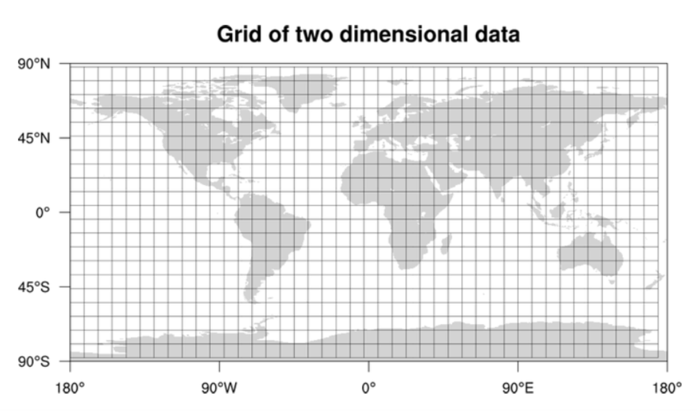
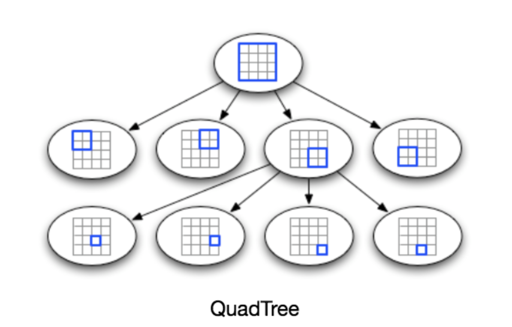

# Requirements and Goals of the System
We will build simple version of Uber.  
## Functional requirement
- There are two types of users a. Drivers b. Riders
- Drivers need to regularly notify the service about their current location and their availability to pick passengers.
- Riders get to see all the nearby available drivers.
- Rider can request for trip, should be able to give options,
    - Cost
    - ETA
    - Book in advance
    - Realtime
- Rider on requesting a trip; nearby drivers are notified that a customer is ready to be picked up.
- Once a driver and a rider accept a ride, a trip is started
- They can constantly see each other’s current location until the trip finishes.
- Upon reaching the destination, the driver marks the journey complete to become available for the next ride.
- Rider pays for ride
- Rider and Driver endorse each other
## Design constraints
- Number of riders: 300 million
- Number of drivers: 1 million
- Daily active riders: 1 million
- Daily active drivers: 500k
- Number of trip per day: 1 million
- All active drivers notify their active location in every 3 seconds
- Once rider puts a request for ride, the system should be able to contact drivers in realtime.
## Not in scope
- Payment service
- Driver and riders endorse each other
- ETA
- Cost of trip
- Book in advance
- Cancel trip
# User registration micro service (Riders + Drivers)
## API
```
POST /users?apiKey=string
{
    username: string
    name: string
    dob: string
    sex: int
    email: string
    password: string
    type: int
}
```
It will write following data in `users` table in database
```
{
    userId: int 4 bytes
    username: string 240 bytes
    name: string 240 bytes
    dob: datetime 8 bytes 
    sex: int 4 bytes
    email: string 240 bytes
    password: string 240 bytes
    type: int 4 bytes
    lastLoggedIn: datetime 8 bytes
    createdAt: datetime 8 bytes
}
```
## Storage estimation
- Size of each document: 996 bytes
- Index on userId and type: 8 bytes
- Size of keys: 10 * 20 bytes = 200 bytes
- Total size for each document: 1204 bytes ~ 1300 bytes
- Total users:  300 million riders + 1 million drivers ~ 301m
- Total storage size: 301 m * 1300 bytes ~ 400gb 
- Storage limit per server: 1TB
- Number of shards: 1
- Number of replicas for failover: 3
- shardKey: userId
- CAP? AP
- Total storage: 3TB
## API Scaling
- Daily active riders: 1 million
- Daily active drivers: 500k
- Total daily active users: 1.5 millions
- 10 % of daily active users as concurrent users: 1.5 m * .10 ~ 150k
- Max concurrent thread per server: 500
- Number of app servers: 150k/500 ~ 300
## Cache required?
- Not required
## API Performance
- Key/value pair write
- Add more replicas of database storage to support concurrent write
# Vehicle registration micro service
## API
```
POST /vehicles?apiKey=string&authToken=string
{
  vin: string
  lat: int
  long: int
  model: string
  make: string
  year: int
  size: string
}
```
It will write following schema in `vehicles` table in database
```
{
  vehicleId: int 4 bytes
  vin: string 240 bytes
  lat: int 4 bytes
  long: int 4 bytes
  model: string 32 bytes
  make: string 32 bytes
  year: int 4 bytes
  size: string 4 bytes
  createdAt: datetime 8 bytes
  updatedAt: datetime 8 bytes
  driverId: int 8 bytes
  locationId: int 4 bytes # locationId is decided after optimizing dashboard service
}
```
## Storage estimation
- Size of each document: 352 bytes
- Index on vehicleId, locationId : 8 bytes
- Size of keys: 12 * 20 bytes = 240 bytes
- Total size for each document: 600 bytes
- Total vehicles ~ 1 million drivers ~ 1m
- Total storage size: 1 m * 600 bytes ~  600 mb
- Storage limit per server: 1TB
- Number of shards: 1
- Number of replicas for failover: 3
- shardKey: vehicleId
- CAP? AP
- Total storage: 3TB
## API Scaling
- Total vehicles ~ Total drivers: 1 million
- Daily active registration: 1% of total ~ 10k
- 10 % of daily registration as concurrent users: 10k * .10 ~ 1000
- Max concurrent thread per server: 500
- Number of app servers: 1000/500 ~ 2
- For failover keep at least 3 app servers
## Cache required?
- Not required
## API Performance
- Key/value pair write

# Vehicle location update micro service
## API
```
PATCH /vehicles/<vehicleId>?apiKey=string&authToken=string
{
  lat: int
  long: int
}
```
It will update `lat`/`long`/`locationId` in `vehicles` table in database
- Get `locationId` from GEO index using binary search range query
## API Scaling
- Number of drivers: 1 million
- Daily active drivers: 500k
- All active drivers notify their active location in every 3 seconds
- Total location update notification per seconds: 500k * 24 * 60 * 60 /3 ~ 14.400b ~ 15b
- Write QPS is huge, need to optimize all layers
### Optimize database write
- Use copy on write
- Support batch update
- Write on majority
### Optimize API server
- Support batch write
- Batch of 1000 at a time
- App server can have 1000 concurrent thread 
- Total concurrent write: 1m
- Number of app servers: 15b/1m ~ 15k
### Add Distributed Messaging Queue int front of app server
- Use Distributed Kafka 
- Message schema
```
{
  vehicleId: int 4 bytes  
  lat: int 4 bytes
  long: int 4 bytes
}
```
- Size of one message: 12 bytes + 3 * 20 bytes ~ 72 bytes ~ 100 bytes
- Size per second: 15b * 100 bytes ~ 1.5 tb
- Number of topics: 1
- More partitions lead to higher throughput
- More Partitions Requires More Open File Handles
- Storage per partition: 1Gb
- Number of partitions: 1500
- With 64GB server, it can hold 60 partitions
- Number of servers: 25
- Assign all consumers in same group, this will let consumer to subscribe unique messages
## Cache required?
- Not required
## API Performance
- Key/value pair write

# Search Vehicles micro service
## API
```
GET /vehicles?apiKey=string&authToken=string&lat=int&long=int&year=int&make=string&model=string&size=string
```
It should return list of vehicles as below
```
[
    {
        vehicleId: string
        driverId: string
        lat: int
        long: int        
    },
    {
        vehicleId: string
        driverId: string
        lat: int
        long: int        
    }    
]
```
## Simple API Algorithm
- Compute distance for each vehicle from rider's location, sort it and get top `k`

- Time complexity: O(N) + O(KlogK) ~ O(N) where N is number of vehicles
- Number of drivers: 1 million
- Daily active drivers: 500k
- N = 500k
- Commodity server takes 100 ms to run 10,000 loops ~ 100 loops/ms
- Total time = 500,000/100 ms = 5000 ms = 5 sec
- This is scalable keeping in mind user experience and future growth

## Optimize API Algorithm dividing world into grid
### Algorithm

- Limit search space for vehicles 
- Divide world map into squares (Google open sourced it)
- Each grid will store all the Places residing within a specific range of longitude and latitude.
- This scheme would enable us to query only a few grids to find nearby drivers.
- Get square box for rider location id 
- For given rider's square box, get nearest location (5 miles) ids of vehicles
- For vehicles location ids, apply other filters and get details
- Main goal is to how to map vehicle location id and rider location id to static square box
    - Rider open app, s/he comes with lat/long
    - Convert lat/long to static location id on map sqaure box
    - Pre-generate static mapping of lat/long for each square box and map to locationId
    ```
        latX    latY    longX   longY   locationId   
        100     100     200     200     1 
    ```
    - Store this data in database as geo spatial index
    - Use rider lat/long to perform binary search based range query to find out locationId
    - For given rider's locationId, how to find out vehicles?
        - Store vehicle's running locationId for each vehicle in `vehicles` table
        ```
            Vehicle ID  Location Id
            V1          L1
            V2          L2
            V3          L2
            V4          L1
            V5          L1
        ```
        - Build inverted index based on locationId for quick lookup and use copy/write to update it
        ```
            LocationId  Vehicle Id
            L1          [V1, V4, V5]
            L2          [V2, V3]        
        ```
        - For given rider locationId, get the list of vehicles
        - If in current locationId, there are very few vehicles, then go extra layer to get all neighbor locationIds and fetch vehicles again
        - Generate level1 static mapping for faster lookup
        - level1 and level2 query can go in parallel
### What could be a reasonable grid size?
- Grid size could be equal to the distance we would like to query since we also want to reduce the number of grids. 
- If the grid size is equal to the distance we want to query, then we only need to search within the grid which contains the given location and neighboring eight grids. 
- Since our grids would be statically defined (from the fixed grid size), we can easily find the grid number of any location (lat, long) and its neighboring grids.
- In the database, we can store the locationId with each location and have an index on it, too, for faster searching. For rider's location `X` and `Y` query will look like:
```
Select * from Drivers where lat between X-D and X+D and long between Y-D and Y+D and locationId in (locationIdR, locationId1, locationId2, locationId3, ..., locationId8)
```
### Should we keep our index in memory?
- Maintaining the index in memory will improve the performance of our service. 
- We can keep our index in a hash table where ‘key’ is the locationId and ‘value’ is the list of lat/long contained in that grid.
### How much memory will we need to store the index?
- Let’s assume our search radius is 5 miles
- Total area of the earth is around 200 million square miles, we will have 40 million grids. 
- We would need a four bytes number to uniquely identify each grid 
```
{
    locationId: int 4 bytes
    latX: int 4 bytes
    longY: int 4 bytes
    latP: int 4 bytes
    latQ: int 4 bytes
}
```
- Size of each document:  20 bytes
- Total size: 40 million * 20 bytes ~ 800 mb 

### Drawback
- This solution can still run slow for those grids that have a lot of drivers due to following reasons
    - During rush hours there will be lot of drivers
    - Due to event, there will be lot of riders and drivers
    - Thickly populated areas like downtown San Francisco will have a lot of drivers, and sparsely populated area like the Pacific Ocean will have small drivers or no drivers

## Optimize API Algorithm dividing world into dynamic grid
### Dynamic Grid
- Let’s assume we don’t want to have more than 100 drivers in a grid so that we can have a faster searching.
- So, whenever a grid reaches this limit, we break it down into four grids of equal size and distribute places among them.
- This means thickly populated areas like downtown San Francisco will have a lot of grids, and sparsely populated area like the Pacific Ocean will have large grids with less drivers only around the coastal lines or no drivers.
### What data-structure can hold this information?
- A tree in which each node has four children can serve our purpose. 
- Each node will represent a grid and will contain information about all the drivers in that grid. 
- If a node reaches our limit of 100 drivers, we will break it down to create four child nodes under it and distribute drivers among them. 
- In this way, all the leaf nodes will represent the grids that cannot be further broken down.
- So leaf nodes will keep a list of drivers with them. 
- This tree structure in which each node can have four children is called a `QuadTree`

### How will we build a QuadTree?
- We will start with one node that will represent the whole world in one grid. 
- Once it will have more than 100 drivers, we will break it down into four nodes and distribute drivers among them. 
- We will keep repeating this process with each child node until there are no nodes left with more than 100 drivers.
### How will we find the grid for a given location?
- We will start with the root node and search downward to find our required node/grid. 
- At each step, we will see if the current node we are visiting has children. 
- If it has, we will move to the child node that contains our desired location and repeat this process. 
- If the node does not have any children, then that is our desired node.
### How will we find neighboring grids of a given grid?
#### Using leaf level linked list
- Since only leaf nodes contain a list of drivers, we can connect all leaf nodes with a doubly linked list. 
- This way we can iterate forward or backward among the neighboring leaf nodes to find out our desired locations. 
#### Using parent pointer
- Another approach for finding adjacent grids would be through parent nodes. 
- We can keep a pointer in each node to access its parent, and since each parent node has pointers to all of its children, we can easily find siblings of a node. 
- We can keep expanding our search for neighboring grids by going up through the parent pointers.

### How much memory will be needed to store the QuadTree? 
### Map driver's location in Quad tree
We have two issues with our Dynamic Grid solution
1. Update grid location
- Since all active drivers are reporting their locations every three seconds, we need to update our data structures to reflect that. 
- If we have to update the QuadTree for every change in the driver’s position, it will take a lot of time and resources. 
- To update a driver to its new location, we must find the right grid based on the driver’s previous location. 
- If the new position does not belong to the current grid, we have to remove the driver from the current grid and move/reinsert the user to the correct grid. 
- After this move, if the new grid reaches the maximum limit of drivers, we have to repartition it.
2. Propagate driver's new location to riders
- We need to have a quick mechanism to propagate the current location of all the nearby drivers to any active trip rider in that area. 
- Also, when a trip is in progress, our system needs to notify both the driver and passenger about the current location of the car.
Although our QuadTree helps us find nearby drivers quickly, a fast update in the tree is not guaranteed.
### Do we need to modify our QuadTree every time a driver reports their location?
- If we don’t update our QuadTree with every update from the driver, it will have some old data and will not reflect the current location of drivers correctly. 
- If you recall, our purpose of building the QuadTree was to find nearby drivers efficiently.
- Since all active drivers report their location every three seconds, therefore there will be a lot more updates happening to our tree than querying for nearby drivers. 
- So, what if we keep the latest position reported by all drivers in a hash table and update our QuadTree a little less frequently? 
- Let’s assume we guarantee that a driver’s current location will be reflected in the QuadTree within 15 seconds. 
- Meanwhile, we will maintain a hash table that will store the current location reported by drivers; let’s call this DriverLocationHT.
### How much memory we need for DriverLocationHT? 
We need to store following 
- DriveID 4 bytes
- Old lat 8 bytes
- Old long 8 bytes
- New lat 8 bytes
- New long 8 bytes
Total size of one record: 36 bytes
Total size for 1 millions driver: 36 bytes * 1m ~ 36mb
### How much bandwidth will our service consume to receive location updates from all drivers?
- If we get DriverID and their location, it will be (3+16 => 19 bytes). 
- If we receive this information every three seconds from 500K daily active drivers, we will be getting 9.5MB per three seconds.
### Do we need to distribute DriverLocationHT onto multiple servers?
- Although our memory and bandwidth requirements don’t require this, since all this information can easily be stored on one server, but, for scalability, performance, and fault tolerance, we should distribute DriverLocationHT onto multiple servers. 
- We can distribute based on the DriverID to make the distribution completely random. 
- Let’s call the machines holding DriverLocationHT the Driver Location server. 
- Other than storing the driver’s location, each of these servers will do two things:
    - As soon as the server receives an update for a driver’s location, they will broadcast that information to all the interested customers.
    - The server needs to notify the respective QuadTree server to refresh the driver’s location. As discussed above, this can happen every 15 seconds.
### How can we efficiently broadcast the driver’s location to customers?
- We can have a Push Model where the server will push the positions to all the relevant users.
- We can have a dedicated Notification Service that can broadcast the current location of drivers to all the interested customers. 
- We can build our Notification service on a publisher/subscriber model. 
- When a customer opens the Uber app on their cell phone, they query the server to find nearby drivers.
- On the server side, before returning the list of drivers to the customer, we will subscribe the customer for all the updates from those drivers. 
- We can maintain a list of customers (subscribers) interested in knowing the location of a driver and, whenever we have an update in DriverLocationHT for that driver, we can broadcast the current location of the driver to all subscribed customers. 
- This way, our system makes sure that we always show the driver’s current position to the customer.
### How much memory will we need to store all these subscriptions?
- As we have estimated above, we will have 1M daily active customers and 500K daily active drivers. 
- On average let’s assume that five customers subscribe to one driver. 
- Let’s assume we store all this information in a hash table so that we can update it efficiently. 
- We need to store driver and customer IDs to maintain the subscriptions. 
- Assuming we will need 4 bytes for DriverID and 4 bytes for CustomerID
- Total memory:  (500K * 4) + (500K * 5 * 4 ) bytes ~ 2000K + 5000k bytes ~ 7000k bytes ~7mb
### How much bandwidth will we need to broadcast the driver’s location to customers?
- For every active driver, we have five subscribers, so the total subscribers we have:
    5 * 500K => 2.5M
- To all these customers we need to send DriverID (4 bytes) and their location (16 bytes) every second, so, we need the following bandwidth:
    2.5M * 20 bytes => 50 MB/s
### How can we efficiently implement Notification service?
We can either use HTTP long polling or push notifications.
### How will the new publishers/drivers get added for a current customer?
- As we have proposed above, customers will be subscribed to nearby drivers when they open the Uber app for the first time, what will happen when a new driver enters the area the customer is looking at? 
- To add a new customer/driver subscription dynamically, we need to keep track of the area the customer is watching. 
- This will make our solution complicated; how about if instead of pushing this information, clients pull it from the server?
### How about if clients pull information about nearby drivers from the server?
- Clients can send their current location, and the server will find all the nearby drivers from the QuadTree to return them to the client. 
- Upon receiving this information, the client can update their screen to reflect the current positions of the drivers. 
- Clients can query every five seconds to limit the number of round trips to the server. 
- This solution looks simpler compared to the push model described above.
### Do we need to repartition a grid as soon as it reaches the maximum limit?
- We can have a cushion to let each grid grow a little bigger beyond the limit before we decide to partition it. 
- Let’s say our grids can grow/shrink an extra 10% before we partition/merge them. 
- This should decrease the load for a grid partition or merge on high traffic grids.
## How would “Request Ride” use case work?
- The customer will put a request for a ride.
- One of the Aggregator servers will take the request and asks QuadTree servers to return nearby drivers.
- The Aggregator server collects all the results and sorts them by ratings.
- The Aggregator server will send a notification to the top (say three) drivers simultaneously, whichever driver accepts the request first will be assigned the ride. 
- The other drivers will receive a cancellation request. 
- If none of the three drivers respond, the Aggregator will request a ride from the next three drivers from the list.
- Once a driver accepts a request, the customer is notified.

# Trip start micro service
```
POST /trips?apiKey=string&authToken=string
{
    driverId: int
    vehicleId: int

}
```
It will write following schema into `trips` table in database
```
{
    tripId: int
    driverId: int
    vehicleId: int
    riderId: int
    state: string
}
```
## Trip update micro service 
```
PATCH /trips/<tripId>?apiKey=string&authToken=string
{
    state: string
}
```
It will update state of trip in `trips` table in database
# Ranking
How about if we want to rank the search results not just by proximity but also by popularity or relevance?
## How can we return top rated drivers within a given radius?
- Let’s assume we keep track of the overall ratings of each driver in our database and QuadTree. 
- An aggregated number can represent this popularity in our system, e.g., how many stars does a driver get out of ten? 
- While searching for the top 10 drivers within a given radius, we can ask each partition of the QuadTree to return the top 10 drivers with a maximum rating. 
- The aggregator server can then determine the top 10 drivers among all the drivers returned by different partitions.

# Advanced Issues
- How will we handle clients on slow and disconnecting networks?
- What if a client gets disconnected when they are a part of a ride? How will we handle billing in such a scenario?
- How about if clients pull all the information, compared to servers always pushing it?